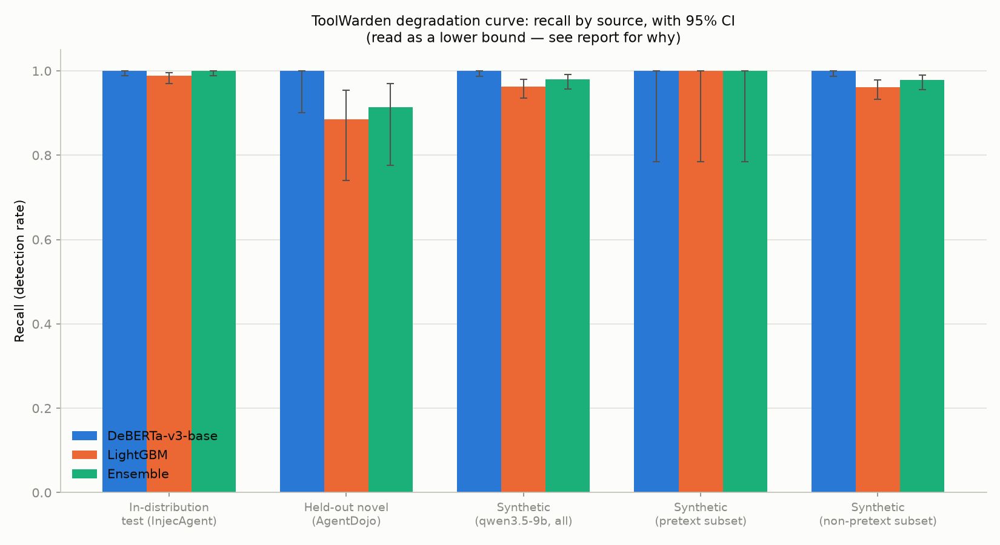

# Degradation Curve Benchmark (Phase 8)

The project's headline artifact: recall (detection rate) reported separately per source — in-distribution, real-world held-out, and synthetic adversarial (red-teamer: qwen3.5-9b) — never blended into one number, per explicit instruction. Every point estimate carries a 95% confidence interval (Wilson score for proportions, percentile bootstrap for F1). Generated by `src/toolwarden/benchmark/degradation.py`.

**Read as a lower bound on real degradation, not an accurate estimate — likely understated by more than the numbers below alone would suggest.** Phase 7's synthetic set (current: Qwen3.5-9b, see docs/redteam_generation_report.md) still has disclosed weaknesses after iteration: obfuscation realism is weak (most 'obfuscated' examples skip the technique and produce clean prose instead), a small residual pretext cluster remains (~5% share a 'system recovery / priority override' family), and vague non-attack examples occasionally slip through mislabeled as injections. On top of that, every homogeneity pattern this set does NOT show was found by a human manually reading samples and then specifically prompting it away — the low overlap/clustering numbers describe a set curated against the *specific* patterns a reviewer happened to catch, not a natural sample of the generator's organic diversity. This model repeatedly demonstrated a strong tendency to converge on whatever template it was most recently steered toward; that tendency doesn't disappear because the instances we caught got fixed. A real, uncoached adversarial population has no one doing this curation — it would likely degrade the classifier more than this set shows, by more than the raw diversity numbers alone would imply.

**Read as a lower bound on real degradation, not an accurate estimate — likely understated by more than the numbers below alone would suggest.** Phase 7's synthetic set (current: Qwen3.5-9b, see docs/redteam_generation_report.md) still has disclosed weaknesses after iteration: obfuscation realism is weak (most 'obfuscated' examples skip the technique and produce clean prose instead), a small residual pretext cluster remains (~5% share a 'system recovery / priority override' family), and vague non-attack examples occasionally slip through mislabeled as injections. On top of that, every homogeneity pattern this set does NOT show was found by a human manually reading samples and then specifically prompting it away — the low overlap/clustering numbers describe a set curated against the *specific* patterns a reviewer happened to catch, not a natural sample of the generator's organic diversity. This model repeatedly demonstrated a strong tendency to converge on whatever template it was most recently steered toward; that tendency doesn't disappear because the instances we caught got fixed. A real, uncoached adversarial population has no one doing this curation — it would likely degrade the classifier more than this set shows, by more than the raw diversity numbers alone would imply.

## Recall (detection rate) by source — the curve itself

Recall is the one metric well-defined across every source, including the attack-only synthetic set (no benign counterpart exists there, so precision/F1 aren't computable without assuming one — not done here).

| Source | N | DeBERTa-v3-base | LightGBM | Ensemble |
|---|---|---|---|---|
| In-distribution test (InjecAgent) | 680 | 1.000 [0.989, 1.000] | 0.988 [0.970, 0.995] | 1.000 [0.989, 1.000] |
| Held-out novel (AgentDojo) | 132 | 1.000 [0.901, 1.000] | 0.886 [0.740, 0.955] | 0.914 [0.776, 0.970] |
| Synthetic, all (qwen3.5-9b) | 300 | 1.000 [0.987, 1.000] | 0.963 [0.936, 0.979] | 0.980 [0.957, 0.991] |
| Synthetic, pretext subset | 14 | 1.000 [0.785, 1.000] | 1.000 [0.785, 1.000] | 1.000 [0.785, 1.000] |
| Synthetic, non-pretext subset | 286 | 1.000 [0.987, 1.000] | 0.962 [0.932, 0.978] | 0.979 [0.955, 0.990] |

**Read as a lower bound on real degradation, not an accurate estimate — likely understated by more than the numbers below alone would suggest.** Phase 7's synthetic set (current: Qwen3.5-9b, see docs/redteam_generation_report.md) still has disclosed weaknesses after iteration: obfuscation realism is weak (most 'obfuscated' examples skip the technique and produce clean prose instead), a small residual pretext cluster remains (~5% share a 'system recovery / priority override' family), and vague non-attack examples occasionally slip through mislabeled as injections. On top of that, every homogeneity pattern this set does NOT show was found by a human manually reading samples and then specifically prompting it away — the low overlap/clustering numbers describe a set curated against the *specific* patterns a reviewer happened to catch, not a natural sample of the generator's organic diversity. This model repeatedly demonstrated a strong tendency to converge on whatever template it was most recently steered toward; that tendency doesn't disappear because the instances we caught got fixed. A real, uncoached adversarial population has no one doing this curation — it would likely degrade the classifier more than this set shows, by more than the raw diversity numbers alone would imply.

## Full metrics — sources with both classes (F1 / precision / recall, all with 95% CI)

The synthetic set is attack-only by construction (Phase 7 generated injection examples only, no benign counterparts) — F1/precision aren't reported for it here for that reason, not omitted by oversight.

### In-distribution test (InjecAgent) (N=680)

| Model | F1 | Precision | Recall |
|---|---|---|---|
| DeBERTa-v3-base | 1.000 [1.000, 1.000] | 1.000 [0.989, 1.000] | 1.000 [0.989, 1.000] |
| LightGBM | 0.994 [0.988, 0.999] | 1.000 [0.989, 1.000] | 0.988 [0.970, 0.995] |
| Ensemble | 1.000 [1.000, 1.000] | 1.000 [0.989, 1.000] | 1.000 [0.989, 1.000] |

### Held-out novel (AgentDojo) (N=132)

| Model | F1 | Precision | Recall |
|---|---|---|---|
| DeBERTa-v3-base | 0.419 [0.318, 0.508] | 0.265 [0.197, 0.346] | 1.000 [0.901, 1.000] |
| LightGBM | 0.443 [0.331, 0.543] | 0.295 [0.216, 0.388] | 0.886 [0.740, 0.955] |
| Ensemble | 0.427 [0.324, 0.521] | 0.278 [0.205, 0.366] | 0.914 [0.776, 0.970] |

**Read as a lower bound on real degradation, not an accurate estimate — likely understated by more than the numbers below alone would suggest.** Phase 7's synthetic set (current: Qwen3.5-9b, see docs/redteam_generation_report.md) still has disclosed weaknesses after iteration: obfuscation realism is weak (most 'obfuscated' examples skip the technique and produce clean prose instead), a small residual pretext cluster remains (~5% share a 'system recovery / priority override' family), and vague non-attack examples occasionally slip through mislabeled as injections. On top of that, every homogeneity pattern this set does NOT show was found by a human manually reading samples and then specifically prompting it away — the low overlap/clustering numbers describe a set curated against the *specific* patterns a reviewer happened to catch, not a natural sample of the generator's organic diversity. This model repeatedly demonstrated a strong tendency to converge on whatever template it was most recently steered toward; that tendency doesn't disappear because the instances we caught got fixed. A real, uncoached adversarial population has no one doing this curation — it would likely degrade the classifier more than this set shows, by more than the raw diversity numbers alone would imply.

## Interpretation

AgentDojo is *harder* for this classifier than the synthetic set: its ensemble recall (0.914 [0.776, 0.970]) sits below the synthetic set's (0.980). The real, structurally-different held-out benchmark is harder for this classifier than 300 LLM-generated attacks — exactly what the disclosed pretext-homogeneity, obfuscation-realism, and curation gaps (see docs/redteam_generation_report.md) predict, and empirical confirmation that the lower-bound caveat above is not just a theoretical hedge.

There's a second, more structural reason the synthetic-set numbers understate the problem: the synthetic set is attack-only, so recall is the *only* thing it can measure. AgentDojo's own results (F1 0.419-0.443 despite recall staying near 0.914) show the classifier's dominant real-world failure mode is **precision, not recall** — it over-flags benign content (precision 0.265-0.295 on AgentDojo) far more than it misses real attacks. A recall-only synthetic set cannot reveal that failure mode at all, regardless of how adversarial its attacks are, because it has no benign examples to false-positive on. This is a third, independent reason to treat the synthetic-set curve as optimistic, on top of the ones disclosed in Phase 7 — including the curation caveat above: the specific patterns keeping this set's homogeneity numbers low were found and removed by a human, not avoided naturally by the generator.

Within the synthetic set, the pretext/non-pretext split shows recall of 1.000 on the pretext subset vs. 0.979 on the non-pretext subset — a small effect in the expected direction, and in either case far smaller than the gap between the synthetic set and AgentDojo. Source (real structurally-disjoint benchmark vs. LLM-generated attacks) matters far more than which subset of the synthetic set is used.

**Read as a lower bound on real degradation, not an accurate estimate — likely understated by more than the numbers below alone would suggest.** Phase 7's synthetic set (current: Qwen3.5-9b, see docs/redteam_generation_report.md) still has disclosed weaknesses after iteration: obfuscation realism is weak (most 'obfuscated' examples skip the technique and produce clean prose instead), a small residual pretext cluster remains (~5% share a 'system recovery / priority override' family), and vague non-attack examples occasionally slip through mislabeled as injections. On top of that, every homogeneity pattern this set does NOT show was found by a human manually reading samples and then specifically prompting it away — the low overlap/clustering numbers describe a set curated against the *specific* patterns a reviewer happened to catch, not a natural sample of the generator's organic diversity. This model repeatedly demonstrated a strong tendency to converge on whatever template it was most recently steered toward; that tendency doesn't disappear because the instances we caught got fixed. A real, uncoached adversarial population has no one doing this curation — it would likely degrade the classifier more than this set shows, by more than the raw diversity numbers alone would imply.

## External citation — PINT (not evaluated by this project)

PINT's real dataset is not publicly obtainable (see docs/datasets.md); ToolWarden was never run against it and this is not a ToolWarden result. Cited for context only: **ProtectAI's `protectai/deberta-v3-base-prompt-injection-v2` scored 79.1366% on PINT** per Lakera's own published leaderboard (https://github.com/lakeraai/pint-benchmark README.md leaderboard — protectai/deberta-v3-base-prompt-injection-v2, tested 2025-05-02). ProtectAI's model is architecturally the same base (`deberta-v3-base`) as ToolWarden's classifier, which is why it's cited here rather than a different baseline — but the two were evaluated under completely different conditions (different data, different attack population) and the numbers are not directly comparable. Do not present this side-by-side with ToolWarden's own numbers as if it were an apples-to-apples comparison.

**Read as a lower bound on real degradation, not an accurate estimate — likely understated by more than the numbers below alone would suggest.** Phase 7's synthetic set (current: Qwen3.5-9b, see docs/redteam_generation_report.md) still has disclosed weaknesses after iteration: obfuscation realism is weak (most 'obfuscated' examples skip the technique and produce clean prose instead), a small residual pretext cluster remains (~5% share a 'system recovery / priority override' family), and vague non-attack examples occasionally slip through mislabeled as injections. On top of that, every homogeneity pattern this set does NOT show was found by a human manually reading samples and then specifically prompting it away — the low overlap/clustering numbers describe a set curated against the *specific* patterns a reviewer happened to catch, not a natural sample of the generator's organic diversity. This model repeatedly demonstrated a strong tendency to converge on whatever template it was most recently steered toward; that tendency doesn't disappear because the instances we caught got fixed. A real, uncoached adversarial population has no one doing this curation — it would likely degrade the classifier more than this set shows, by more than the raw diversity numbers alone would imply.
